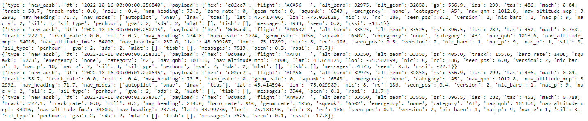
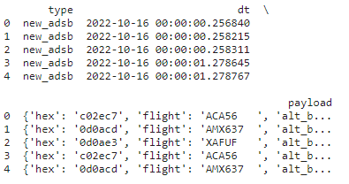
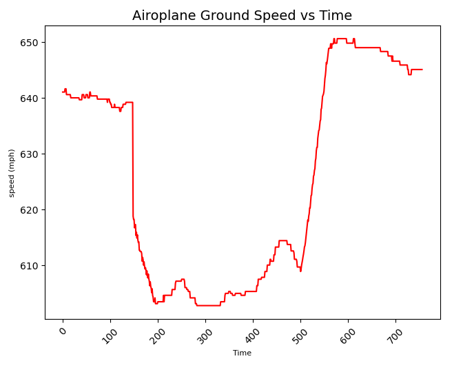

# ADS-B Exchange Data Analysis - 

## Introduction:
For this Project as `IA626 Big Data Course`, I worked on the `ADS-B Exchange` Aircraft tracking data. Initially I have used three textfiles for `NY-USA` for ADS-B Data. Transponder systems such as ADS-B [(Automatic Dependent Surveillance-Broadcast)](https://globe.adsbexchange.com/) is equipped in aircraft. Around seventy percent of commericial aircraft use this system. This system records the information which can be used to retrieve key values such as aircraft speed, latitude, longitude, vertical speed, altitude, many more. 

## Dataset Explanation
dt: the time this file was generated, in seconds since Jan 1 1970 00:00:00 GMT (the Unix epoch)
flight: callsign, the flight name or aircraft registration as 8 chars (2.2.8.2.6)
alt_baro: the aircraft barometric altitude in feet
alt_geom: geometric (GNSS / INS) altitude in feet referenced to the WGS84 ellipsoid
gs: ground speed in knots
ias: indicated air speed in knots
tas: true air speed in knots
mach: Mach number
track: true track over ground in degrees (0-359)
track_rate: Rate of change of track, degrees/second
roll: Roll, degrees, negative is left roll
mag_heading: Heading, degrees clockwise from magnetic north
true_heading: Heading, degrees clockwise from true north (usually only transmitted on ground, in the air usually derived from the magnetic heading using magnetic model WMM2020)
baro_rate: Rate of change of barometric altitude, feet/minute
geom_rate: Rate of change of geometric (GNSS / INS) altitude, feet/minute
squawk: Mode A code (Squawk), encoded as 4 octal digits
emergency: ADS-B emergency/priority status, a superset of the 7×00 squawks (2.2.3.2.7.8.1.1)
category: emitter category to identify particular aircraft or vehicle classes (values A0 – D7) (2.2.3.2.5.2)

## Loading Libraries Required

```python

import json
import pandas as pd
import matplotlib.pyplot as plt

```
## ETL Process - 

#### Method to read the text files

There are number of files so, I created a method to read file, convert it to json format and append it to dictionary. Dictionaries are easy to process and efficiently processed in python. 

```python
def data_extraction(file):
    f = open(file,"r")
#     n=0
    data = []
    #convert each line to dictionary and append it to list of dictionaries
    for line in f:
        dic = json.loads(line)
        data.append(dic)
#         if n > 100:
#             break
#         n+=1
    return data

```

#### Reading data files

```python

#As i have checked for data format
f1 = "adsblog_ny0.txt.2022101600"
f2 = "adsblog_ny0.txt.2022101700"
f3 = "adsblog_ny0.txt.2022101800"

data1 = data_extraction(f1)
data2 = data_extraction(f2)
data3 = data_extraction(f3)

```
## Analysis / Filtering -

Initially I am looking at multiple files in text format. 
1. What type of data structure is data file in? 

```python
for i in range(5):
    print(data1[i])

```



2. Use dataframes to easily process the data?  

```python
#converting list of dic. to pandas dataframe to easily work with it as pandas has alot of resources to work with 
df1 = pd.DataFrame(data1)
df2 = pd.DataFrame(data2)
df3 = pd.DataFrame(data3)

```

3. What attributes in the data are important to analyze?

```python
print(df1.head(5))
```
Number of elements in `payload` are important to analyze. 
```python
print(df1['payload'])

```


`payload` structure in different part of dataframs are different. 

```python
print('flight' in df1['payload'][0].keys())
print(df2['payload'][0].keys())
print("--------------------------")
print(df1['payload'][0].keys())
print("--------------------------")
print(df3['payload'][0].keys())
```


4. Merge dataframes (group by) common attribute?

```python
def dataframe_setup(df):
    df1 = pd.DataFrame(columns=['dt', 'flight', 'alt_baro', 'alt_geom', 'gs', 'track', 'geom_rate', 'squawk', 'emergency', 'category', 'nav_qnh', 'nav_altitude_mcp', 'nav_heading', 'nav_modes', 'lat', 'lon', 'nic', 'rc', 'seen_pos', 'version', 
                            'nic_baro', 'nac_p', 'nac_v', 'sil', 'sil_type', 'gva', 'sda', 'mlat', 'tisb', 'messages', 'seen', 'rssi'])
    list_k = ['flight', 'alt_baro', 'alt_geom', 'gs', 'track', 'geom_rate', 'squawk', 'emergency', 'category', 'nav_qnh', 'nav_altitude_mcp', 'nav_heading', 'nav_modes', 'lat', 'lon', 'nic', 'rc', 'seen_pos', 'version', 
                            'nic_baro', 'nac_p', 'nac_v', 'sil', 'sil_type', 'gva', 'sda', 'mlat', 'tisb', 'messages', 'seen', 'rssi']
    
    for i in range(len(df)):
        try: 
            if all(value in df['payload'][i].keys() for value in list_k):
                df1 = df1.append({'dt': df['dt'][i], 'flight': df['payload'][i]['flight'], 'alt_baro': df['payload'][i]['alt_baro'], 'alt_geom': df['payload'][i]['alt_geom'], 'gs': df['payload'][i]['gs'],'track': df['payload'][i]['track'],'geom_rate': df['payload'][i]['geom_rate'], 'squawk': df['payload'][i]['squawk'], 'emergency': df['payload'][i]['emergency'], 'category': df['payload'][i]['category'], 'nav_qnh': df['payload'][i]['nav_qnh'], 'nav_altitude_mcp': df['payload'][i]['nav_altitude_mcp'], 'nav_heading': df['payload'][i]['nav_heading'], 'lat': df['payload'][i]['lat'], 'lon': df['payload'][i]['lon'], 'nic': df['payload'][i]['nic'], 'rc': df['payload'][i]['rc'], 'seen_pos': df['payload'][i]['seen_pos'], 'version': df['payload'][i]['version'], 'nic_baro': df['payload'][i]['nic_baro'], 'nac_p': df['payload'][i]['nac_p'], 'nac_v': df['payload'][i]['nac_v'], 'sil': df['payload'][i]['sil'], 'sil_type': df['payload'][i]['sil_type'], 'gva': df['payload'][i]['gva'], 'sda': df['payload'][i]['sda'], 'mlat': df['payload'][i]['mlat'],'tisb': df['payload'][i]['tisb'], 'messages': df['payload'][i]['messages'], 'seen': df['payload'][i]['seen'], 'rssi': df['payload'][i]['rssi']}, ignore_index=True)
                #print(df1)
        except Exception as e:
            pass
            #print(e)
    return df1
```
```python
df11 = dataframe_setup(df1)
df22 = dataframe_setup(df2)
df33 = dataframe_setup(df3)

df11.reset_index(drop=True, inplace=True)
df22.reset_index(drop=True, inplace=True)
df33.reset_index(drop=True, inplace=True)
```

5. Storing data in CSV format for future processing.
    * There are multiple solutions to this techniques, explained below
    * `CSV` - very slow, does convert it text mode (Used this method)
    * `HDFS` - shorter, more elegant, faster but out of scope for this course
    * `Pickles`- using pickles, binary mode

```python
#I can save these dataframes as CSV files and latter use it for analysis one by one
df11.to_csv('file1.csv')
df22.to_csv('file2.csv')
df33.to_csv('file3.csv')
```

```python
#if i want to combine all these dataframes to a single one. I am trying cancatenation 
frames = [df11, df22, df33]
result_df = pd.concat(frames, ignore_index=True)
#Or i can save this dataframe as single CSV file combined
result_df.to_csv('data/combined_dataset.csv')

```

6. Let's Visualize speed for a flight vs time.

```python
import matplotlib.pyplot as plt
x = range(len(fACA56_gs['dt']))
plt.plot(x, fACA56_gs['gs'] * 1.151, color='red', label="mbps")
plt.tight_layout()
#plt.set_index("dt",drop=True,inplace=True)
plt.xticks(rotation=45)
plt.title('Airoplane Ground Speed vs Time', fontsize=14)
plt.xlabel("Time", fontsize=8)
plt.ylabel('speed (mph)', fontsize=8)
plt.grid(False)
plt.show()

```




Different keys represent following information: 
  hex (String optional)
  flight (String optional - name of plane)
  alt_baro (int optional - altitude)
  alt_geom (int optional) 
  track (int optional)
  baro_rate (int optional)
  category (string optional)
  nav_qnh (float optional)
  nav_altitude_mcp (int optional)
  nav_heading (float optional)
  nic (int optional)
  rc (int optional)
  seen_pos (float optional)
  version (int optional)
  nic_baro (int optional)
  nac_p (int optional)
  nac_v (int optional)
  sil (int optional) 
  sil_type (string optional)
  mlat (array optional)
  tisb (array optional)
  messages (int optional)
  seen (float optional)
  rssi (float optional)  
  squawk (optional) - look at # conversion 7600, 7700, 4000, 5000, 7777, 6100, 5400, 4399, 4478, ...)
  speed (optional)
  mach (optional speed, mac to mph *767)
  emergency (optional string)
  lat (long optional)
  lon (long optional)
 
 
 
